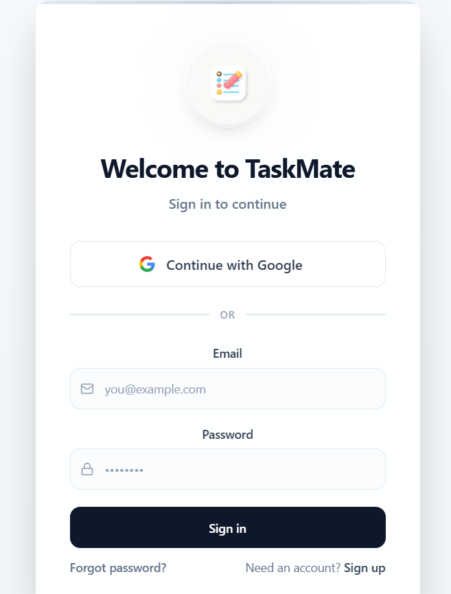

📝 TaskMate

TaskMate is a modern and responsive To-Do List Web App designed to help you stay productive and organized.
It comes with Dark Mode, Categories, Search, and Local Storage to keep your tasks safe even after refreshing or closing the browser.

🛠️ Tech Stack

HTML5 – Structure

CSS3 – Styling (with Dark Mode)

JavaScript (ES6) – Functionality

(Optional) Tailwind/Bootstrap for UI improvements

🚀 Features

✨ Add, edit, delete tasks

✅ Mark tasks as complete/incomplete

🗑️ Clear completed tasks with one click

📂 Categorize tasks (Work, Study, Personal, etc.)

⏰ Set due dates for tasks

🔍 Search and filter tasks easily

🌙 Dark Mode with saved preference

💾 Persistent storage using Local Storage

📱 Mobile-friendly & responsive design

🤝 Contributing

Contributions are welcome! 💡

Fork the repo

Create a new branch (git checkout -b feature-name)

Make your changes and commit (git commit -m "Added new feature")

Push to your fork and create a Pull Request

📜 License

This project is licensed under the MIT License – feel free to use, modify, and share.

